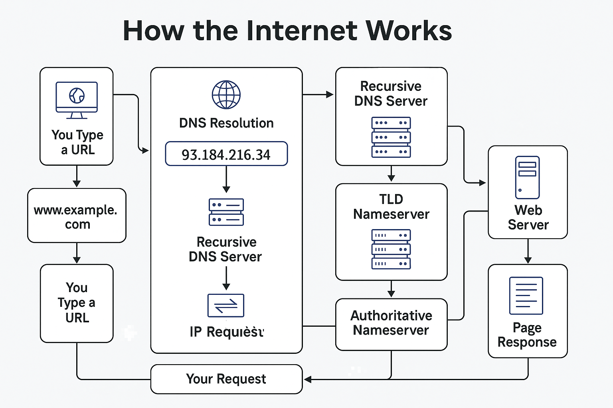

# Networking

## **Network Protocols – Quick Notes**

### 🔹 What are Network Protocols?

- **Definition:** Set of rules that define how data is transmitted across a network.
- **Purpose:** Ensure **communication**, **reliability**, **security**, and **organization** between devices.

---

### 📐 **OSI Model (7 Layers)** – Protocol Placement

| Layer | Function | Examples |
| --- | --- | --- |
| 7. **Application** | Interface for end-user | HTTP, FTP, DNS, SMTP |
| 6. **Presentation** | Data formatting, encryption | SSL/TLS |
| 5. **Session** | Connection control | NetBIOS, PPTP |
| 4. **Transport** | Reliable transmission | TCP, UDP |
| 3. **Network** | Routing and addressing | IP, ICMP |
| 2. **Data Link** | Physical addressing | Ethernet, MAC |
| 1. **Physical** | Hardware transmission | Cables, switches |

---

### 🧭 **Important Network Protocols + Port Numbers**

| Protocol | Port | Transport | Purpose |
| --- | --- | --- | --- |
| **HTTP** | 80 | TCP | Web traffic (insecure) |
| **HTTPS** | 443 | TCP | Secure web traffic |
| **FTP** | 21 | TCP | File transfers |
| **SFTP** | 22 | TCP | Secure file transfer (uses SSH) |
| **SSH** | 22 | TCP | Secure remote login |
| **DNS** | 53 | TCP/UDP | Domain name resolution |
| **SMTP** | 25 | TCP | Sending emails |
| **IMAP** | 143 | TCP | Receiving emails (modern) |
| **POP3** | 110 | TCP | Receiving emails (older) |
| **DHCP** | 67/68 | UDP | Auto IP assignment |
| **Telnet** | 23 | TCP | Remote access (insecure) |
| **SNMP** | 161 | UDP | Network device monitoring |
| **RDP** | 3389 | TCP | Remote desktop access |
| **ICMP** | N/A | IP-based | Used for ping/echo requests |

---

### 🧱 **TCP vs UDP** – Transport Layer

| Feature | **TCP** | **UDP** |
| --- | --- | --- |
| Connection | Yes (reliable) | No (faster) |
| Order guaranteed? | ✅ | ❌ |
| Speed | Slower | Faster |
| Use Case | HTTP, FTP, SSH | DNS, VoIP, video streaming |

---

### 💡 Examples in Action:

**When you browse a website**:

- Your computer uses **DNS (53)** to resolve the domain.
- Connects to server via **TCP (port 80 or 443)**.
- Data moves through all 7 OSI layers.

### 🔌 What Are **Ports** in Networking?

A **port** is a **logical endpoint** for communication used by the operating system to distinguish different types of network traffic.

Think of it like:

- **IP address** = street address (identifies the computer)
- **Port** = apartment number (identifies the specific application or service on that computer)

---

### 🔹 How Ports Work – Step-by-Step:

1. **When you connect to a server** (e.g., visit a website):
    - Your browser connects to the server’s **IP address** on **port 80 (HTTP)** or **443 (HTTPS)**.
    - This tells the server which service you're trying to use.
2. **Server listens on specific ports**:
    - A web server like Apache or Nginx listens on **port 80/443**.
    - An SSH server listens on **port 22**.
    - A DNS server listens on **port 53**.
3. **Client uses a random high-numbered port**:
    - Your computer uses a temporary **ephemeral port** (e.g., 49152–65535) to start the connection.
    - This lets your system track **which app requested what**.

---

### 🧭 Port Types:

| Port Range | Type | Description |
| --- | --- | --- |
| **0–1023** | **Well-known ports** | Reserved for system services (e.g., HTTP, FTP) |
| **1024–49151** | **Registered ports** | Used by user apps (e.g., game servers) |
| **49152–65535** | **Dynamic/Private ports** | Temporarily assigned by OS (ephemeral) |

---

### 🔒 Example: Visiting a Website (HTTP/HTTPS)

- You type `www.example.com`
- Your system:
    - Resolves the domain via **DNS (port 53)**
    - Connects to `93.184.216.34:80` (HTTP)
- Your browser talks to the server over **port 80**, and server responds
- All this may happen using your **random local port** like `49544`

---

### 🧱 TCP vs UDP Ports

- **TCP Ports**: For reliable connections (e.g., web, email, SSH)
- **UDP Ports**: For fast, connectionless services (e.g., DNS, VoIP)

---

### 🔐 Port Security Note

- Open ports can be scanned by attackers.
- **Firewalls** and **port filtering** help close unused ports and protect systems.

## ENCAPSULTION

As the data is passed down each layer of the model, more information containing details specific to the layer in question is added on to the start of the transmission. As an example, the header added by the Network Layer would include things like the source and destination IP addresses, and the header added by the Transport Layer would include (amongst other things) information specific to the protocol being used. The data link layer also adds a piece on at the *end* of the transmission, which is used to verify that the data has not been corrupted on transmission; this also has the added bonus of increased security, as the data can't be intercepted and tampered with without breaking the trailer. This whole process is referred to as *encapsulation;* the process by which data can be sent from one computer to another.

Notice that the encapsulated data is given a different name at different steps of the process. In layers 7,6 and 5, the data is simply referred to as data. In the transport layer the encapsulated data is referred to as a segment or a datagram (depending on whether TCP or UDP has been selected as a transmission protocol). At the Network Layer, the data is referred to as a packet. When the packet gets passed down to the Data Link layer it becomes a frame, and by the time it's transmitted across a network the frame has been broken down into bits.

When the message is received by the second computer, it reverses the process -- starting at the physical layer and working up until it reaches the application layer, stripping off the added information as it goes. This is referred to as *de-encapsulation.* As such you can think of the layers of the OSI model as existing inside every computer with network capabilities. Whilst it's not actually as clear cut in practice, computers all follow the same process of encapsulation to send data and de-encapsulation upon receiving it.

The processes of encapsulation and de-encapsulation are very important -- not least because of their practical use, but also because they give us a standardised method for sending data. This means that all transmissions will consistently follow the same methodology, allowing any network enabled device to send a request to any other reachable device and be sure that it will be understood -- regardless of whether they are from the same manufacturer; use the same operating system; or any other factors.

## Top Ports

20/21 (TCP) – FTP: File Transfer Protocol (Data/Control)

22 (TCP) – SSH: Secure remote login

23 (TCP) – Telnet: Insecure remote login (legacy)

25 (TCP) – SMTP: Sending emails

53 (TCP/UDP) – DNS: Domain name resolution

67/68 (UDP) – DHCP: IP address assignment (Server/Client)

69 (UDP) – TFTP: Lightweight file transfer

80 (TCP) – HTTP: Insecure web traffic

110 (TCP) – POP3: Receiving emails

123 (UDP) – NTP: Time synchronization

137-139 (TCP/UDP) – NetBIOS: Windows file/printer sharing

143 (TCP) – IMAP: Email access on server

161/162 (UDP) – SNMP: Network device monitoring

389 (TCP/UDP) – LDAP: Directory services (AD)

443 (TCP) – HTTPS: Secure web traffic

445 (TCP) – SMB: Windows file sharing

465 (TCP) – SMTPS: Secure mail (SSL/TLS)

514 (UDP) – Syslog: System logging (Linux/Unix)

587 (TCP) – SMTP (Submission): Secure mail with STARTTLS

636 (TCP) – LDAPS: Secure LDAP

993 (TCP) – IMAPS: Secure IMAP

995 (TCP) – POP3S: Secure POP3

1433 (TCP) – MSSQL: Microsoft SQL Server

1521 (TCP) – Oracle DB: Oracle database access

3306 (TCP) – MySQL: MySQL database

3389 (TCP) – RDP: Remote Desktop (Windows)

5432 (TCP) – PostgreSQL: PostgreSQL database

5900 (TCP) – VNC: Remote desktop access

8080 (TCP) – HTTP-Alt: Proxy or web apps (alt HTTP port)